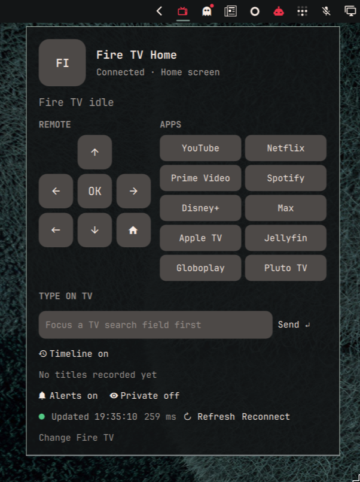

# Fire TV Now Playing for Omarchy

A compact [Omarchy](https://omarchy.org/) bar widget for an Amazon Fire TV Stick. Click the TV icon to see the foreground app and, when the app exposes it through Android's media session, the current title, artist, album, playback state, and artwork. The panel also has a remote, playback controls, shortcuts for supported apps installed on **your** Fire TV, and text entry for a focused TV search field.

The widget talks to the stick over Android Debug Bridge (ADB). It does not require an account or a companion app on the TV for local network use. Fire OS and each streaming app decide which playback details are available: some show only the app name, and Prime Video may expose a placeholder instead of the actual title.



## Compatibility

**Tested:** Fire TV Stick HD running Fire OS 7 (Android 9). The plugin requires Android ADB over the network on port 5555 and reads `dumpsys media_session` and `dumpsys window` output. Amazon also ships Android-based Fire OS 5, 6, 8, 14, and 16 devices, but this plugin has not been tested on them. ADB connection and basic remote keys may work; title detection and app shortcuts depend on each device's command output and installed packages.

**Not supported:** Vega OS devices, including the Fire TV Stick 4K Select (2025) and Fire TV Stick HD (2026). They use a different operating system and developer toolchain. Check the device's release year and OS version; the name “Fire TV Stick HD” alone is not enough to identify compatibility. Amazon lists models and OS versions in its [Fire TV device specifications](https://www.developer.amazon.com/docs/device-specs/identify-fire-tv-devices.html).

## Requirements

- Omarchy with the Quattro plugin system.
- Python 3, `adb` from `android-tools`, `ip` from `iproute2` for local discovery, and `timeout` from `coreutils`. `notify-send` from `libnotify` is needed only for desktop alerts. ImageMagick's `magick` is optional for artwork; without it the widget uses the app icon.
- An Amazon Fire TV with **ADB Debugging** enabled and reachable from this computer on TCP port 5555. The TV must authorize this computer's ADB connection.

On Omarchy, install ADB if needed:

```sh
omarchy pkg add android-tools
```

ADB access gives the connected computer control of the TV. Enable it only on a network you trust, and revoke the computer's authorization on the TV if you no longer use this plugin. The plugin runs with your normal user permissions and does not install a background service.

## Install

Install from the public repository:

```sh
omarchy plugin add https://github.com/kevinbsr/omarchy-firetv.git --enable
```

Click the TV icon in the bar to set up the connection. The first-run panel scans at most 512 addresses on directly connected private IPv4 networks for port 5555. If it finds one candidate, it tries to connect; if it finds several, choose the Fire TV. You can also enter its IPv4 address manually. Discovery does not connect to every candidate.

On the TV, enable **Settings → My Fire TV → Developer Options → ADB Debugging**. If Developer Options is hidden, press the device name under **My Fire TV → About** seven times. Accept the TV's debugging authorization prompt when the plugin connects. The computer and TV should be on the same local network. Use **Change Fire TV** in the panel if its IP address changes.

## Use and configure

- The bar shows a small TV icon. Click it to open or close the panel; Escape closes it. The widget checks the TV every 15 seconds by default.
- The remote has directional keys, Select, Back, and Home. Previous, Play/Pause, Next, Rewind, and Fast Forward appear when relevant; the media app determines which actions work and how far seeking moves.
- App shortcuts list supported apps actually installed on the connected TV. Selecting one opens it and may interrupt playback. Unsupported apps can still appear as the foreground app, but do not get a shortcut.
- **Type on TV** sends up to 100 basic Latin characters to the TV's currently focused text field. Focus a search field on the TV first.
- **Alerts** notify you when the visible title changes. The first title seen after shell startup does not trigger an alert. **Private** hides titles in bar tooltips and alerts; an open panel still shows them.
- **Timeline** is off by default. When enabled, it records title changes locally in `~/.local/state/omarchy/firetv/history.json` (up to 100 entries, owner-only file permissions). Turning it off stops new entries; **Clear history** deletes the saved entries. The plugin reads only activity on the Fire TV Stick, not other TV inputs.
- **Refresh** checks again immediately. **Reconnect** restarts this computer's ADB connection to the TV.

The TV address, refresh interval (10–120 seconds), and feature defaults can be changed in Omarchy's widget settings. App logos come from locally installed desktop icons when available; otherwise the panel shows a two-letter badge and notifications use the bundled TV icon. Artwork is optional: only HTTPS URLs resolving to public addresses are fetched, with a 1 MiB download limit and a six-second deadline. ImageMagick decodes them under resource limits into small local PNGs in `~/.cache/omarchy/firetv/artwork/`. Local URLs, redirects, oversized images, and failed decodes fall back to the app icon.

## Optional access over Tailscale

If the Fire TV supports Tailscale, install its official Android app on the TV, sign it into the same tailnet as this computer, and enter the TV's `100.x.y.z` address manually. Some Fire TV models do not offer Tailscale in the Amazon Appstore; in that case, sideloading the official APK may be possible. Local discovery does not scan the tailnet. ADB Debugging and TV authorization are still required, and the plugin still connects to port 5555. Tailscale is optional for ordinary local network use.

## Remove

```sh
omarchy plugin remove kevin.firetv
```

If you enabled Timeline, remove its local data separately if you no longer want it:

```sh
rm -rf ~/.local/state/omarchy/firetv
rm -rf ~/.cache/omarchy/firetv
```

You can also revoke the computer's debugging authorization under the TV's Developer Options.

## Development

Validate the repository before submitting changes:

```sh
omarchy plugin validate .
qmllint -I "$OMARCHY_PATH/shell" BarWidget.qml
python3 -m py_compile firetv_status.py
python3 -m unittest discover -s tests
```

The plugin consists of `BarWidget.qml`, `firetv_status.py`, and `firetv-icon.svg`. It uses fixed system paths for Python, ADB, IP, timeout, and optional ImageMagick and notification tools. The helper runs with a cleared environment and bounded child output. It never downloads or executes remote code. Licensed under [MIT](LICENSE).
